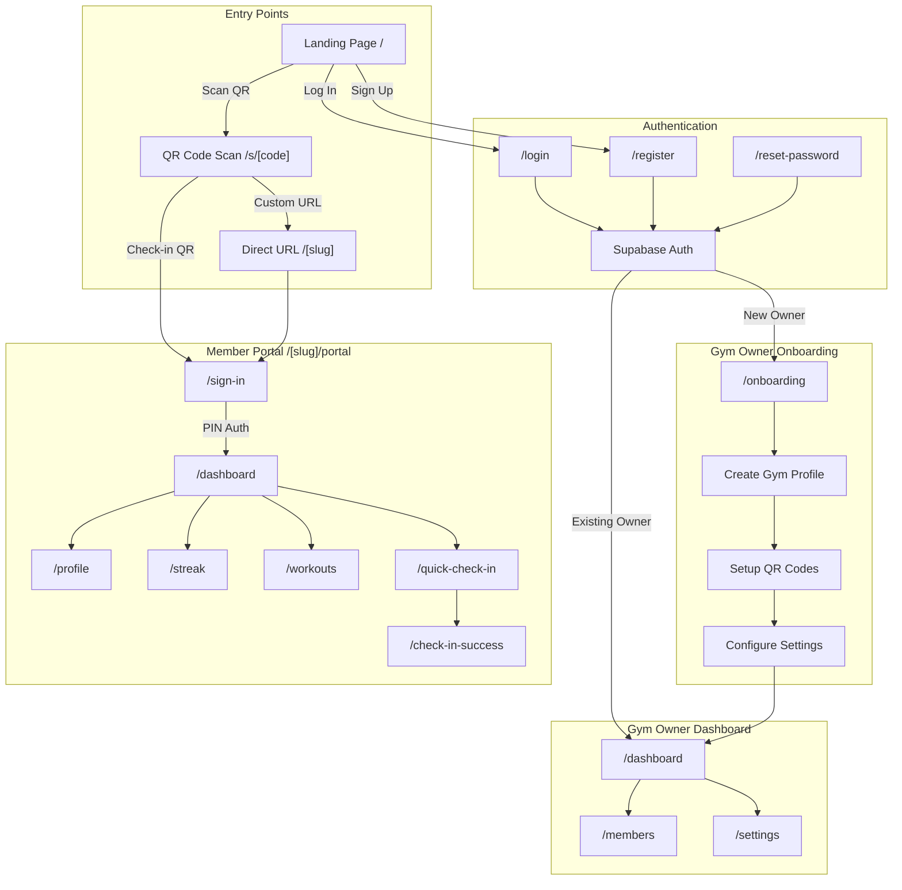
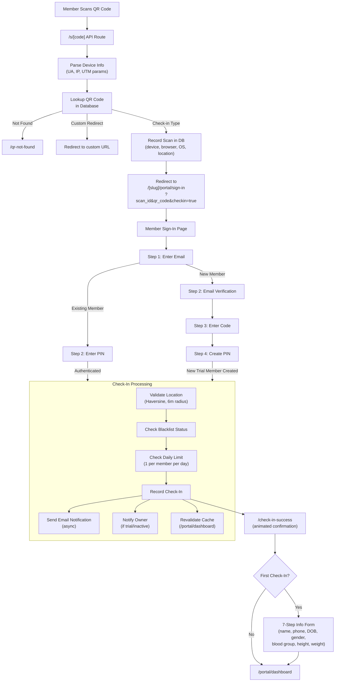
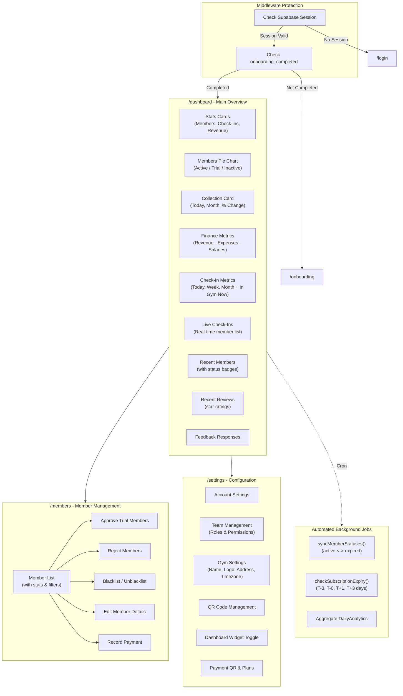
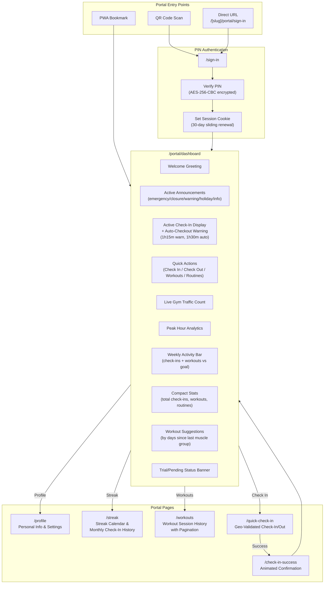
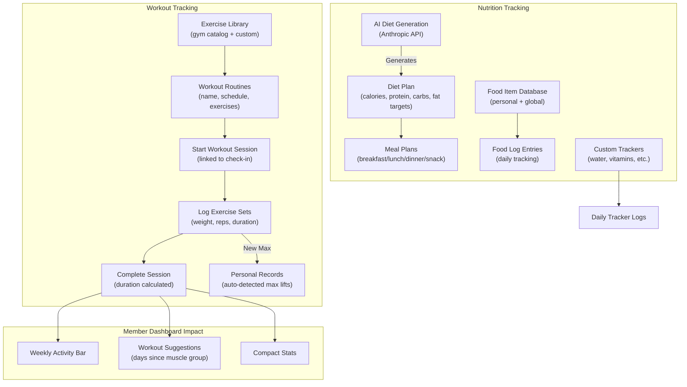
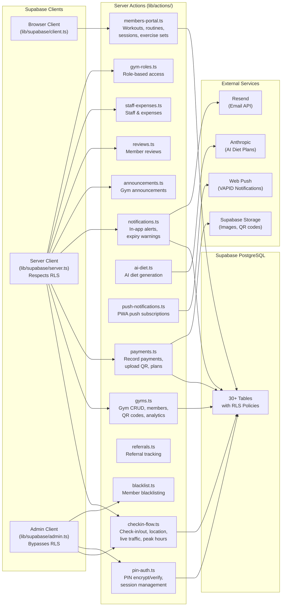
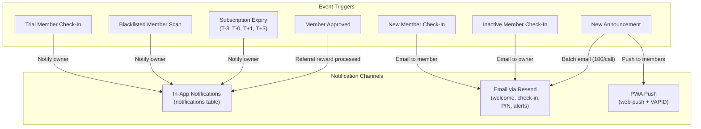

# Inkuity - Complete Application Flow

## 1. High-Level Application Architecture

---

## 2. QR Code Scan & Check-In Flow

---

## 3. Gym Owner Dashboard Flow

---

## 4. Member Portal Flow

---

## 5. Workout & Nutrition Tracking Flow

---

## 6. Data Flow & Server Actions Map

---

## 7. Notification & Communication Flow

---

## How to View These Diagrams

1. **GitHub** - Push this file; diagrams render automatically
2. **VS Code** - Install "Markdown Preview Mermaid Support" extension
3. **Online** - Paste individual diagram blocks at [mermaid.live](https://mermaid.live)
4. **Export as PNG** - Use Mermaid CLI: `npx @mermaid-js/mermaid-cli mmdc -i docs/codebase-flow.md -o docs/flow.png`
